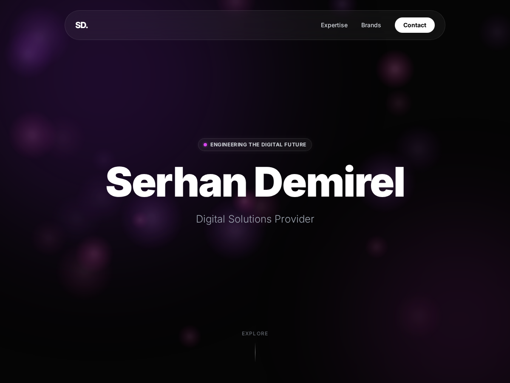
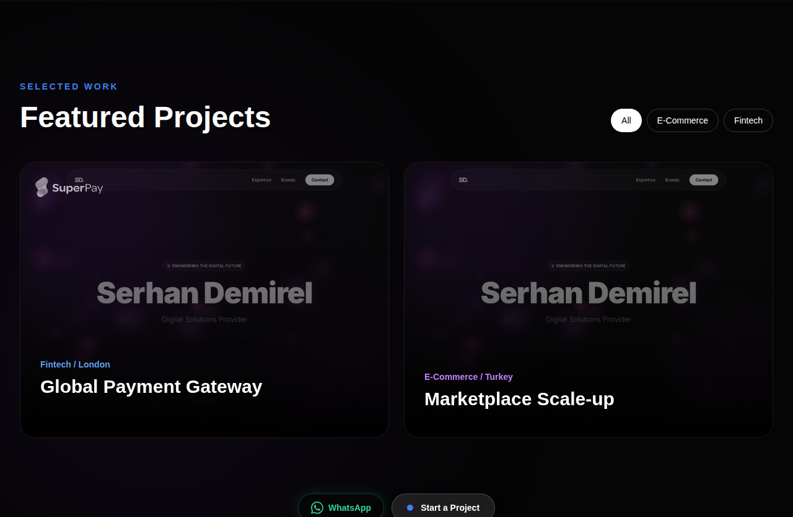
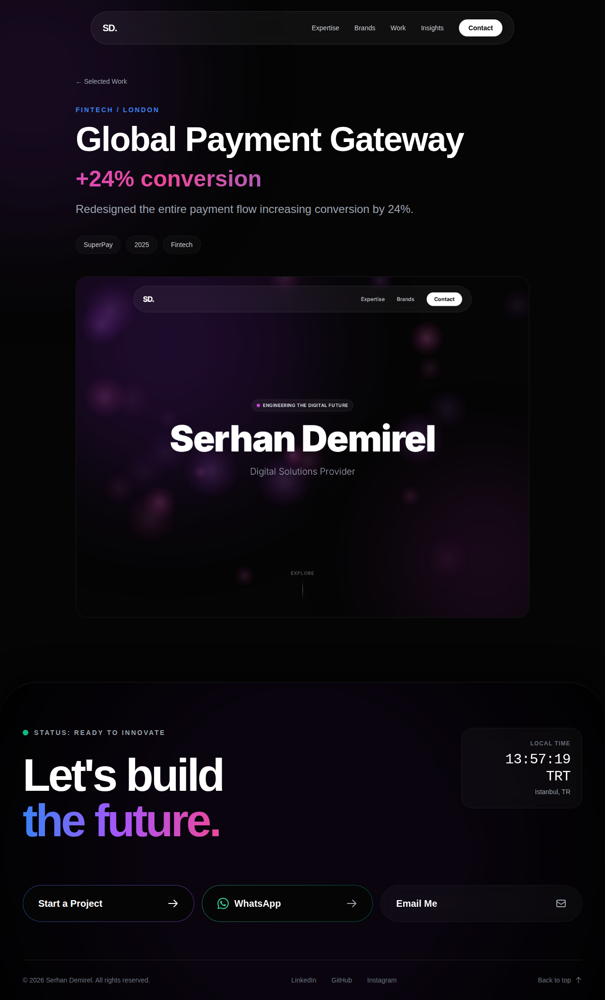
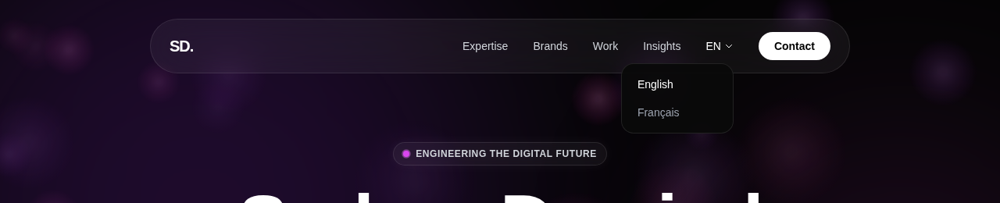
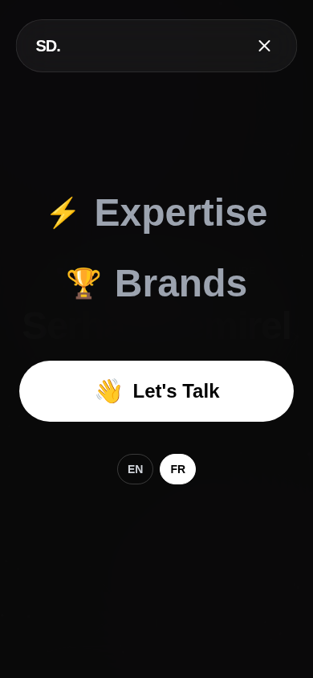

# serhandemirel.com for WordPress

The WordPress theme and companion plugin for [serhandemirel.com](https://serhandemirel.com). The original one-page site lives in [serhanco/serhandemirel.comLP](https://github.com/serhanco/serhandemirel.comLP).

The folders mirror a WordPress install, so each one can be copied (or zipped and uploaded) straight into `wp-content/`:

| Folder | What it is |
| --- | --- |
| [`wp-content/themes/serhandemirel`](wp-content/themes/serhandemirel) | The theme: templates, settings panel, tracking, compiled Tailwind ([README](wp-content/themes/serhandemirel/README.md)) |
| [`wp-content/plugins/serhandemirel-core`](wp-content/plugins/serhandemirel-core) | **Serhan Demirel Core**: projects, expertise, brands, messages and the contact form, so content survives a theme change ([README](wp-content/plugins/serhandemirel-core/README.md)) |
| [`scripts/`](scripts) | Local WordPress Playground setup |
| [`docs/screenshots/`](docs/screenshots) | Screenshots of the theme |

Install both: the theme renders the site, the plugin holds its content. Activate the theme first, then the plugin; on activation the plugin imports the expertise cards and brand logos from the theme.

## Run it locally

```
./scripts/start.sh
```

This starts WordPress Playground at http://127.0.0.1:9400 with the theme and plugin mounted from this repo, activates both and sets the site title (`scripts/blueprint.json`). Log in at http://127.0.0.1:9400/wp-login.php with `admin` / `password`. Playground keeps nothing between restarts. Needs Node 20 or newer.

## Screenshots



| Selected Work | Project page |
| --- | --- |
|  |  |

| Language switcher (desktop) | Language switcher (mobile) |
| --- | --- |
|  |  |
